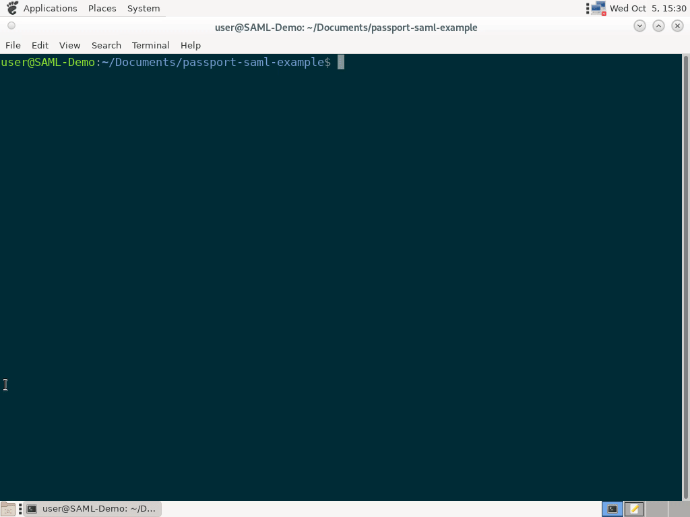

# passport-saml-example

This node.js web application demonstrates SSO authentication provided by a SAML server (such as https://fs.uhn.ca/), using the `passport-saml` package.



Config
======

This app requires 3 files to be placed in a folder named `cert/saml`
located in the project's root directory. These files include:

- `idp_cert.pem`: The certificate  of the Identity Provider (IdP).
- `cert.pem`: Your own SAML certificate
- `key.pem`: The private key associated with your own SAML certificate.

Next, copy `.env.sample` to `.env` and edit appropriately.

Creating Private Key and Certificates
=====================================

The SP files ( `cert/saml/cert.pem`, `cert/saml/key.pem` ) can be
generated with the following command (accepting all default options):

```bash
openssl req -x509 -newkey rsa:4096 -keyout key.pem -out cert.pem -nodes -days 900
```

The IdP Certificate ( `idp_cert.pem` ) can be obtained through the
following commands.

```bash
echo "-----BEGIN CERTIFICATE-----" > cert/saml/idp_cert.pem
python3 print_idp_cert_from_url.py --saml_metadata_url https://fs.uhn.ca/FederationMetadata/2007-06/FederationMetadata.xml >> cert/saml/idp_cert.pem
echo "-----END CERTIFICATE-----" >> cert/saml/idp_cert.pem
```

Registering the Service Provider
================================

The administator of the SAML identity provider (eg. `https://fs.uhn.ca`)
will need to be provided with `cert.pem` in order to configure SAML
authentication for this domain.

Building
========

For running locally
-------------------

```bash
npm install
```

For running in Docker
---------------------

```bash
docker build -t data-team-uhn/passport-saml-example .
```

Usage
=====

Running locally, HTTP-mode
--------------------------

```bash
node app.js
```

Running in Docker, HTTP-mode
----------------------------

```bash
docker run --rm -v $(realpath cert):/app/cert:ro -v $(realpath .env):/app/.env:ro -p 127.0.0.1:8080:8080 --name passport-saml-example -d data-team-uhn/passport-saml-example
```

Running locally, HTTPS-mode
---------------------------

- Place your `cert.pem` and `key.pem` files that you wish to use for
securing the connection to the _passport-saml-example_ server in the
`cert/https/` directory.

- Start `app.js` with:

```bash
USE_SSL=true node app.js
```

Running in Docker, HTTPS-mode
-----------------------------

- Place your `cert.pem` and `key.pem` files that you wish to use for
securing the connection to the _passport-saml-example_ server in the
`cert/https/` directory.

- Start the Docker container with the command:

```bash
docker run --rm -v $(realpath cert):/app/cert:ro -v $(realpath .env):/app/.env:ro -p 127.0.0.1:8443:8443 -e USE_SSL=true --name passport-saml-example -d data-team-uhn/passport-saml-example
```

**Note: All above mentioned Docker containers can be stopped by running `docker stop passport-saml-example`.**

**Note: The logs of the above mentioned Docker containers can be viewed by running `docker logs passport-saml-example`.**
